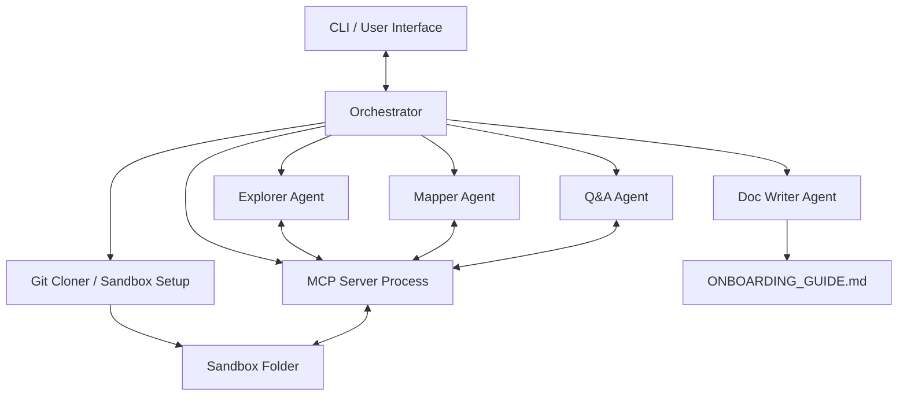

# Codebase Onboarding Concierge - Design Plan

The **Codebase Onboarding Concierge** is an AI-powered developer onboarding assistant. When pointed at any GitHub repository (or local folder), it uses a multi-agent crew communicating with a sandboxed MCP (Model Context Protocol) server to analyze the repository structure, trace code dependencies, extract key data flows, draft a high-quality onboarding `README.md`, and answer interactive developer questions with precise citations.

---

## 1. System Architecture

The overall system is designed to run locally via a CLI or containerized on a server (e.g., Cloud Run). 

### Components:
1. **CLI**: The command-line interface exposes:
   - `onboard analyze <repo_url_or_path>`: Full codebase onboarding guide generation.
   - `onboard ask <repo_path> "<question>"`: Q&A session with citations to files and line numbers.
   - `onboard serve <repo_path>`: Exposes the repository analyzer as a standard MCP server for other IDE clients.
2. **Orchestrator**: Clones the repo to a sandboxed directory, boots the read-only MCP Server, and manages the pipeline execution (Explorer $\rightarrow$ Mapper $\rightarrow$ Doc-Writer).
3. **MCP Server**: Runs as a separate process (or in-process stdio interface) wrapping the sandboxed repository with strict read-only tool definitions.
4. **Agents**: LLM-driven agents executing specialized prompts and invoking MCP tools to accomplish tasks.

---

## 2. Multi-Agent Crew

Each agent is given a specific system prompt, clear objectives, and a subset of MCP tools.

| Agent | Purpose | Primary Tools | Output |
| :--- | :--- | :--- | :--- |
| **Explorer Agent** | Walks the file tree and indexes files, noting programming languages and core layout. | `list_files`, `get_git_history` | Directory structural map, main modules summary, active developers list. |
| **Mapper Agent** | Analyzes code imports, dependencies, symbols, and identifies data flow routes/entry points. | `search_symbols`, `run_ast_query`, `read_file` | Dependency graph summary, major entry points, routing definitions, data flows. |
| **Doc-Writer Agent** | Synthesizes structural maps and data flow graphs into a premium, newcomer-friendly markdown guide. | None (Synthesis tool) | Beautifully written onboarding guide (`ONBOARDING_GUIDE.md`) with setup guides and ranked good first issues. |
| **Q&A Agent** | Solves interactive developer questions. Traces functionality on demand. | `search_symbols`, `run_ast_query`, `read_file`, `list_files` | Precise answers with citations (file path + line range). |

---

## 3. MCP Server & Tool Definitions

The MCP server wraps file operations, ensuring isolation and safety. The following tools will be implemented:

1. **`list_files`**
   - *Arguments*: none
   - *Output*: List of file paths, sizes, and extensions. Recursively traverses the directory while excluding `.git`, `node_modules`, `.venv`, and other binary/dependency folders.
2. **`read_file`**
   - *Arguments*: `path` (relative to sandbox root)
   - *Output*: String content of the file. Validates that the requested path is inside the sandbox.
3. **`search_symbols`**
   - *Arguments*: `query` (regex or substring)
   - *Output*: List of files, line numbers, and contents matching classes, function declarations, interfaces, or variables.
4. **`get_git_history`**
   - *Arguments*: `limit` (default: 20)
   - *Output*: Git commit log details, recent modified files, and top commit authors to locate key subject matter experts.
5. **`run_ast_query`**
   - *Arguments*: `path` (relative to sandbox root)
   - *Output*: List of imports, class definitions (with methods), and function signatures. Built using Python's native `ast` module for python files, and optimized regex-based parsers for other languages (JS/TS, Go, Java).

---

## 4. Security Sandbox & Execution Model

Security is a primary concern when running analysis tools on arbitrary codebases.
- **Read-Only Access**: All file operations (`read_file`, `list_files`, etc.) verify that the path does not escape the sandboxed directory (resolving symlinks and checking prefixes).
- **No Command Execution**: The toolset contains no shell or execution tools (`run_command` or similar). The agents only analyze code structures.
- **Secrets via Env**: API keys (e.g. `GEMINI_API_KEY`) are passed via environment variables, avoiding configuration files containing credentials.

---

## 5. Deployment & Containerization

A `Dockerfile` will package the codebase onboarding concierge:
- Installs `git` and Python dependencies.
- Runs the CLI or launches a server.
- Easy deployment to Google Cloud Run by wrapping the orchestrator in a lightweight FastAPI/Flask endpoint, exposing the onboard analysis via an HTTP API or standard MCP HTTP/SSE transport.

---

## 6. Action Plan
1. **Task 1: MCP Server & Tool Implementation** (`src/mcp_server.py`)
   - Standard stdio-based MCP server using the official Python `mcp` SDK.
   - Implement read-only tools: `list_files`, `read_file`, `search_symbols`, `get_git_history`, `run_ast_query`.
2. **Task 2: Codebase Utilities** (`src/utils.py`)
   - Repository sandboxed cloner.
   - AST parsing functions.
3. **Task 3: Agent Implementations** (`src/agents/`)
   - Set up base agent utilizing Gemini API (`google-generativeai`) with tool calling capability.
   - Implement Explorer, Mapper, Doc-Writer, Q&A agents.
   - Implement the main pipeline Orchestrator.
4. **Task 4: CLI Interface** (`src/cli.py`)
   - Build a clean command-line interface using `argparse` or `click`.
5. **Task 5: Docker & Readme Configuration** (`Dockerfile`, `README.md`)
   - Multi-stage Docker build, Cloud Run deployment guidelines, and usage demos.
